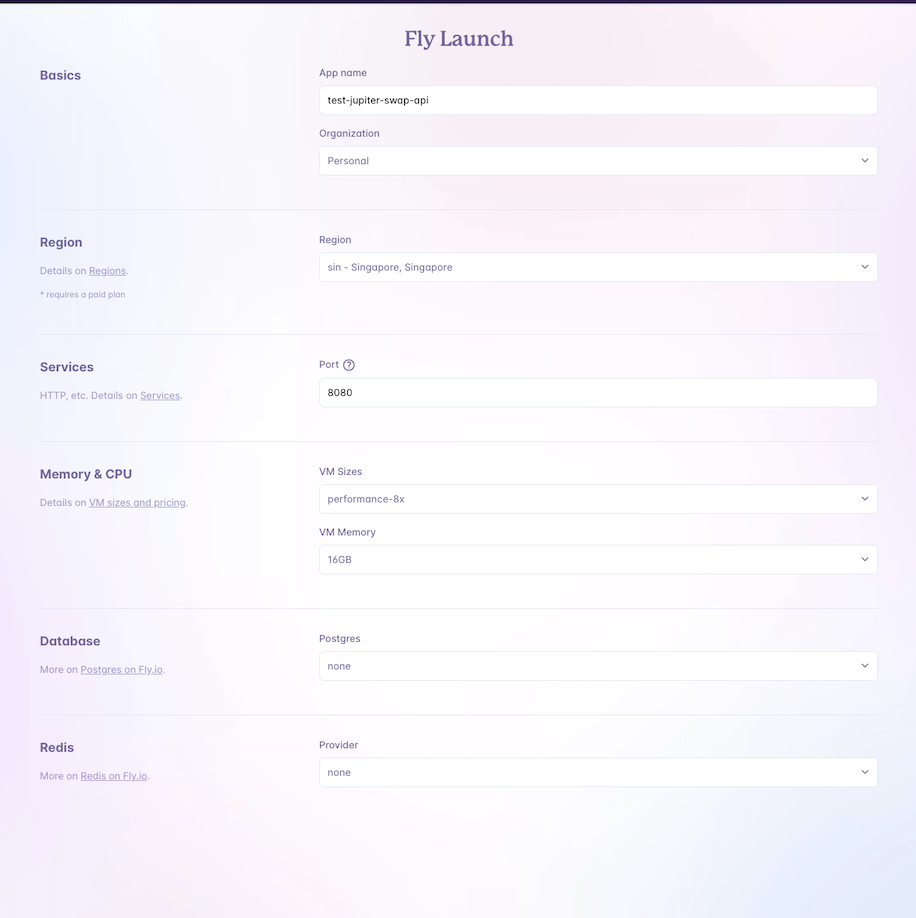

# Deploy Jupiter V6 Swap API on Fly.io

https://fly.io/

## To launch an app in fly.io

```
fly launch
```



<b>Note:</b>
- Create an app name
- Recommended size: performance-8x


## To do deployment updates, when new new version release

```
fly deploy
```